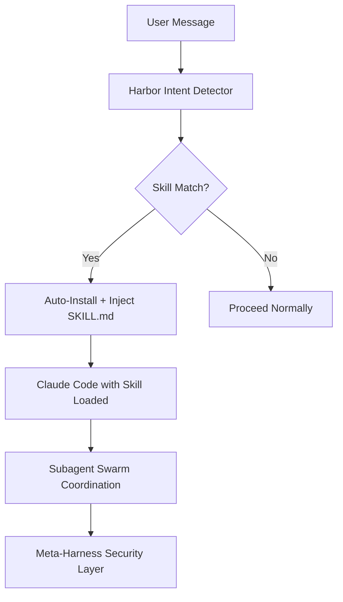

<p align="center">
  
</p>

<h1 align="center">Harbor — The Skills Operating System for Claude Code</h1>

**Harbor** is the intelligent meta-harness that turns Claude Code into an autonomous, self-improving agent swarm.

Automatically detect, install, and inject the perfect Claude Skills. Coordinate subagent swarms. Enforce security with a Ruflo-inspired meta-harness. Reduce token usage by 90%+.

[](https://www.npmjs.com/package/harbor)
[](https://github.com/tiger3homs/harbor)
[](https://opensource.org/licenses/MIT)
[](https://nodejs.org/)

**GitHub:** [github.com/tiger3homs/harbor](https://github.com/tiger3homs/harbor)

---

## Why Harbor?

Claude Code is powerful, but it has three major problems:

1. **Skills are passive** — Users must manually run `npx skills add ...` every time
2. **Context bloat** — Tool outputs and history explode token usage
3. **No coordination** — No built-in way to run multiple specialized agents

**Harbor solves all three** with a single, elegant system.

---

## Key Features

### 🧠 Automatic Skill Intelligence
- Detects intent from natural language
- Installs missing skills automatically via `npx skills`
- Injects full `SKILL.md` content into Claude’s context in real time
- 20+ built-in skill patterns (playwright, api-docs, security, docker, etc.)

### 🐝 Subagent Swarms
- Spawn specialized subagents with dedicated skills
- Parallel execution with consensus modes (raft, byzantine, gossip)
- Self-healing swarm coordination (inspired by Ruflo)

### 🔒 Meta-Harness Security
- Ruflo-style manifest fingerprinting
- Automatic API key & secret redaction
- MCP governance policies
- Swarm health monitoring

### ⚡ 90%+ Token Reduction
- Headroom + Caveman compression stack
- Layered memory retrieval (search → timeline → full)
- Reversible CCR compression

### 🛠️ Structured Workflows
- Mandatory `/plan` → `/act` with architect/editor split
- Interactive TUI (`harbor skills --tui`)
- Docker-ready with one-command deployment

---

## Quick Start

```bash
# Install globally
npm install -g harbor

# Start the daemon
harbor start

# Launch the beautiful TUI
harbor skills --tui
```

Or with Docker:

```bash
docker-compose up -d
```

---

## How It Works



---

## Core Capabilities

| Capability                    | Description                                      | Token Savings |
|------------------------------|--------------------------------------------------|---------------|
| Skill Detection & Injection  | Automatic `SKILL.md` activation                  | High          |
| Subagent Orchestration       | Parallel specialized agents                      | Very High     |
| Meta-Harness + Redaction     | Ruflo-style security & swarm management          | —             |
| Multi-layer Compression      | Headroom + Caveman + CCR                         | 60–95%        |
| Progressive Memory           | Claude-Mem style layered retrieval               | ~10×          |
| Structured Plan/Act          | caveman-code style workflows                     | —             |

---

## API Highlights

```bash
# Detect and activate skills automatically
POST /skills/detect          { "task": "write e2e tests for checkout" }

# Spawn subagents
POST /subagents/spawn        { "skill": "playwright-cli", "task": "..." }

# Check swarm health
GET  /harness/status

# Redact sensitive data
POST /harness/redact
```

---

## Deployment

Harbor ships with first-class Docker support:

```bash
docker build -t harbor .
docker run -p 37701:37701 harbor
```

See [deploy/README.md](deploy/README.md) for Railway, Render, Fly.io, Kubernetes, and PM2 instructions.

---

## Comparison

| Tool                    | Skill Auto-Detection | Subagent Swarms | Meta-Harness | Token Reduction | Security |
|-------------------------|----------------------|------------------|--------------|------------------|----------|
| **Harbor**              | ✅ Yes               | ✅ Yes           | ✅ Yes       | ✅ 90%+          | ✅ Ruflo |
| Claude Code (vanilla)   | ❌ Manual            | ❌ No            | ❌ No        | ❌ None          | Basic    |
| Cursor / Windsurf       | Partial              | Limited          | No           | Partial          | Basic    |
| Other CLI agents        | No                   | No               | No           | Varies           | None     |

---

## Roadmap

- [ ] Real-time skill injection into running Claude sessions
- [ ] Vector memory + semantic RAG
- [ ] Full YAML recipe engine
- [ ] Visual swarm dashboard (TUI + web)
- [ ] Claude Code Marketplace plugin

---

## Built With

Harbor combines the best ideas from:

- [ruvnet/ruflo](https://github.com/ruvnet/ruflo) — Meta-harness & swarm intelligence
- [vercel-labs/skills](https://github.com/vercel-labs/skills) — Open agent skills ecosystem
- [JuliusBrussee/caveman-code](https://github.com/JuliusBrussee/caveman-code) — Token-efficient workflows
- [thedotmack/claude-mem](https://github.com/thedotmack/claude-mem) — Persistent memory
- [headroomlabs-ai/headroom](https://github.com/headroomlabs-ai/headroom) — Reversible compression

---

## Contributing

We welcome contributions! See [CONTRIBUTING.md](CONTRIBUTING.md).

---

## License

MIT © [tiger3homs](https://github.com/tiger3homs)

---

## Links

- **GitHub**: [github.com/tiger3homs/harbor](https://github.com/tiger3homs/harbor)
- **npm**: [npmjs.com/package/harbor](https://www.npmjs.com/package/harbor)
- **Issues**: [github.com/tiger3homs/harbor/issues](https://github.com/tiger3homs/harbor/issues)

---

**Harbor** — Give Claude Code its own operating system.